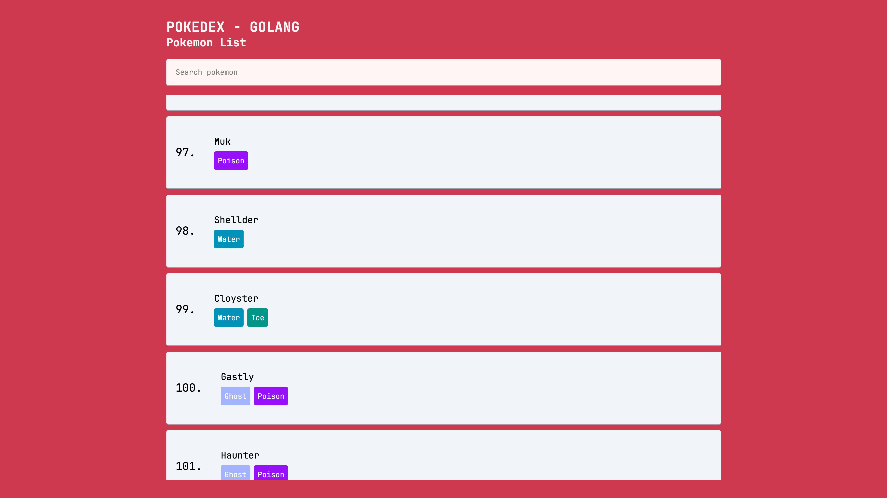
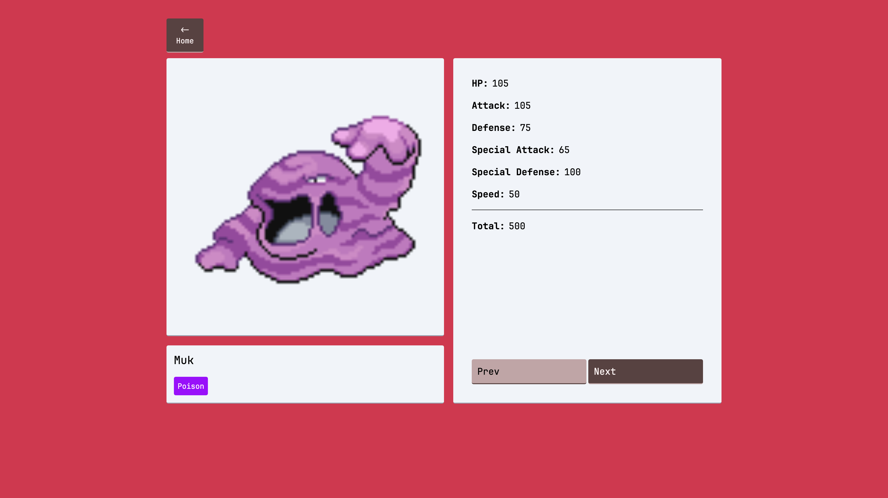

# 🌟 Go-Pokédex 🌟

[](https://golang.org)
[](https://echo.labstack.com/)
[](https://entgo.io/)
[](https://github.com/a-h/templ)
[](https://alpinejs.dev/)
[](https://tailwindcss.com/)
[](https://www.typescriptlang.org/)
[](https://esbuild.github.io/)
[](https://www.docker.com/)

## 📋 Description

Un Pokédex moderne développé en Go avec une architecture DDD (Domain-Driven Design) avec la GOAT stack. Ce projet stocke les données de tous les Pokémon en base de données et permet de consulter leurs statistiques détaillées.

### 🛠️ Technologies utilisées

- **Backend**:
    - Go avec le framework Echo
    - Ent comme ORM
    - Architecture DDD (Domain-Driven Design)
    - Génération de clients API via OpenAPI & Swagger

- **Frontend**:
    - Templ pour le rendu HTML
    - Alpine.js pour l'interactivité
    - TypeScript pour la typographie
    - Tailwind CSS pour le style
    - esbuild pour la compilation des assets

- **Infrastructure**:
    - 100% dockerisé
    - Make pour l'automatisation des tâches

## ⚙️ Installation

### Prérequis

- Docker
- Make

### 🚀 Démarrage rapide

1. **Cloner le dépôt**

```bash
git clone https://github.com/your-username/pokedex-golang-goat.git
cd pokedex-golang-goat
```

2. **Configuration de l'environnement**

```bash
cp .env .env.local
# Éditer .env.local avec vos paramètres
```

3. **Installation et compilation**

```bash
make install
make build-assets
```

4. **Lancer l'application en mode développement**

```bash
make dev
```

## 📊 Source des données

Les données Pokémon utilisées dans ce projet ont été récupérées depuis : https://gist.github.com/armgilles/194bcff35001e7eb53a2a8b441e8b2c6
et les images sont récupéré avec l'api pokemon : https://pokeapi.co/

## 🔄 Développement

### Commandes Make disponibles

```makefile
# Commandes principales
make dev                # Démarrer l'environnement de développement
make clean-dev          # Arrêter les conteneurs et supprimer les volumes
make install            # Construire l'image Docker de build
make build-assets       # Générer les entités, installer les dépendances npm, générer l'API et builder les assets

# Commandes supplémentaires
make swag               # Générer la documentation Swagger
make gen-api            # Générer les clients API TypeScript
make ci-backend         # Lancer les vérifications de code (format et vet)
make vet                # Vérifier le code Go
make fmt                # Formater le code Go
make ent                # Générer le code Ent
```

### Scripts npm

```json
"scripts": {
  "tailwind:build": "Compiler les styles Tailwind CSS",
  "esbuild:build": "Compiler TypeScript avec esbuild",
  "tailwind:watch": "Compiler Tailwind en mode watch",
  "esbuild:watch": "Compiler TypeScript en mode watch",
  "tailwind:mini": "Minifier les styles Tailwind",
  "esbuild:mini": "Minifier le JavaScript compilé",
  "build": "Builder les assets (Tailwind + esbuild)",
  "mini": "Minifier tous les assets",
  "prettier:fix": "Formater le code avec Prettier"
}
```

## 🐳 Docker

Le projet est entièrement dockerisé, ce qui facilite la configuration et l'exécution dans n'importe quel environnement. Deux fichiers Docker sont principalement utilisés :

- `docker/Dockerfile.build` - Pour la construction des assets
- `docker/Dockerfile.dev` - Pour l'environnement de développement
- `docker-compose.dev.yml` - Pour l'environnement de développement

## 📸 Captures d'écran




## 👤 Auteur

Redginald Godeau

-----

⭐ N'hésitez pas à star le projet si vous l'appréciez ! ⭐